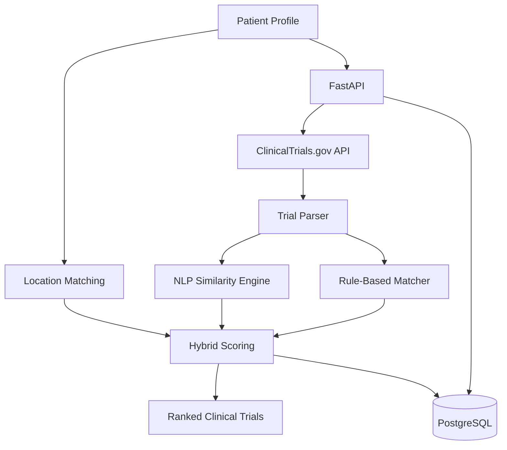

# 🏥 AI Clinical Trial Matching System

An AI-powered healthcare application that matches patient profiles with relevant clinical trials using real-time ClinicalTrials.gov data, rule-based eligibility logic, NLP similarity scoring, and location-aware ranking.

The application is built with **Python, FastAPI, scikit-learn, PostgreSQL, and Docker**.

---

## 🚀 Project Overview

Finding appropriate clinical trials can require reviewing large amounts of eligibility information.

This project demonstrates a clinical trial matching pipeline that:

1. Accepts a structured patient profile.
2. Retrieves relevant studies from ClinicalTrials.gov.
3. Parses trial eligibility information.
4. Evaluates rule-based matching criteria.
5. Calculates NLP similarity between the patient profile and trial information.
6. Considers trial recruitment status and location.
7. Generates a ranked list of potentially relevant clinical trials.

---

## ✨ Features

- FastAPI REST API
- ClinicalTrials.gov API integration
- Real-time clinical trial retrieval
- Patient profile validation with Pydantic
- Rule-based eligibility matching
- Age and sex eligibility checks
- Recruitment-status evaluation
- Location-aware trial matching
- TF-IDF NLP text representation
- Cosine similarity scoring
- Hybrid rule + NLP ranking
- PostgreSQL database integration
- Docker containerization
- Docker Compose environment
- Automated testing with pytest
- Interactive Swagger API documentation

---

## 🧠 Matching Approach

The matching engine combines structured rules with NLP-based similarity.

### Rule-Based Matching

The system evaluates factors such as:

- Patient condition
- Age requirements
- Sex eligibility
- Recruitment status
- Trial location

### NLP Similarity

Patient information and clinical trial text are transformed using:

**TF-IDF (Term Frequency-Inverse Document Frequency)**

Similarity is calculated using:

**Cosine Similarity**

### Hybrid Ranking

The current implementation combines the rule-based score and NLP score to rank candidate trials.

This approach provides an interpretable baseline while leaving room for future semantic matching using embeddings and large language models.

---

## 🏗️ Architecture



---

## 🛠️ Technology Stack

| Technology | Purpose |
|---|---|
| Python | Core application |
| FastAPI | REST API |
| Pydantic | Request validation |
| ClinicalTrials.gov API | Clinical trial data |
| scikit-learn | TF-IDF and cosine similarity |
| PostgreSQL | Data persistence |
| SQLAlchemy | Database ORM |
| pytest | Automated testing |
| Docker | Application containerization |
| Docker Compose | API + database orchestration |
| Git / GitHub | Version control |

---

## 📂 Project Structure

```text
ai-clinical-trial-matcher/
│
├── app/
│   ├── api/
│   ├── database/
│   ├── models/
│   ├── services/
│   ├── utils/
│   └── main.py
│
├── scripts/
├── tests/
├── data/
├── notebooks/
│
├── Dockerfile
├── compose.yaml
├── requirements.txt
├── .dockerignore
├── .gitignore
└── README.md
```

---

## 🐳 Run with Docker

### Prerequisites

Install:

- Docker Desktop
- Git

Clone the repository:

```bash
git clone https://github.com/suryajoy11/ai-clinical-trial-matcher.git
cd ai-clinical-trial-matcher
```

Start the application:

```bash
docker compose up --build
```

After the containers start, open the interactive API documentation:

```text
http://127.0.0.1:8000/docs
```

---

## 🔌 API Example

### Match a Patient to Clinical Trials

Endpoint:

```http
POST /match/
```

Example synthetic patient:

```json
{
  "patient_id": "P001",
  "age": 57,
  "gender": "Male",
  "condition": "Type 2 Diabetes",
  "medications": ["Metformin"],
  "diagnoses": ["Hypertension"],
  "biomarkers": ["HbA1c 8.2"],
  "city": "Orlando",
  "state": "Florida",
  "country": "United States"
}
```

Example response structure:

```json
{
  "patient_id": "P001",
  "condition": "Type 2 Diabetes",
  "trials_found": 10,
  "matches": [
    {
      "nct_id": "NCTXXXXXXXX",
      "title": "Example Clinical Trial",
      "status": "RECRUITING",
      "rule_score": 85,
      "nlp_score": 42.5,
      "score": 72.25,
      "reasons": [
        "Patient condition matches trial title",
        "Patient meets trial age requirements"
      ],
      "warnings": []
    }
  ]
}
```

Actual trial results depend on the current data returned by ClinicalTrials.gov.

---

## 🧪 Running Tests

Run:

```bash
python -m pytest tests/ -v
```

The test suite validates core matching behavior, including scoring and eligibility warnings.

---

## 🔐 Privacy and Healthcare Safety

This repository is intended for **educational, research, and portfolio purposes**.

The examples use synthetic patient information.

The application:

- Does not provide medical advice.
- Does not determine final clinical trial eligibility.
- Should not be used as a substitute for review by qualified healthcare professionals or clinical trial investigators.
- Should not be used with protected health information (PHI) without appropriate security, privacy, compliance, and governance controls.

Final eligibility for a clinical trial must be determined by the responsible clinical trial team.

---

## 🗺️ Future Improvements

Planned improvements include:

- Semantic embeddings for patient-trial matching
- LLM-assisted eligibility criteria extraction
- More robust age/unit parsing
- Structured inclusion and exclusion criteria
- Improved geographic ranking
- Database migrations with Alembic
- API response schemas
- Expanded unit and integration testing
- Mocked external API testing
- GitHub Actions CI/CD
- MLflow experiment tracking
- Cloud deployment
- Authentication and authorization
- Production-grade privacy and security controls

---

## 👨‍💻 Author

**Suryaprakash Telagathoti**

Computer Science | Python | AI/ML | Healthcare AI

---

## 📌 Project Status

**Active Development**

The current version provides an end-to-end baseline for retrieving clinical trials and ranking them against structured patient profiles using rule-based and NLP techniques.